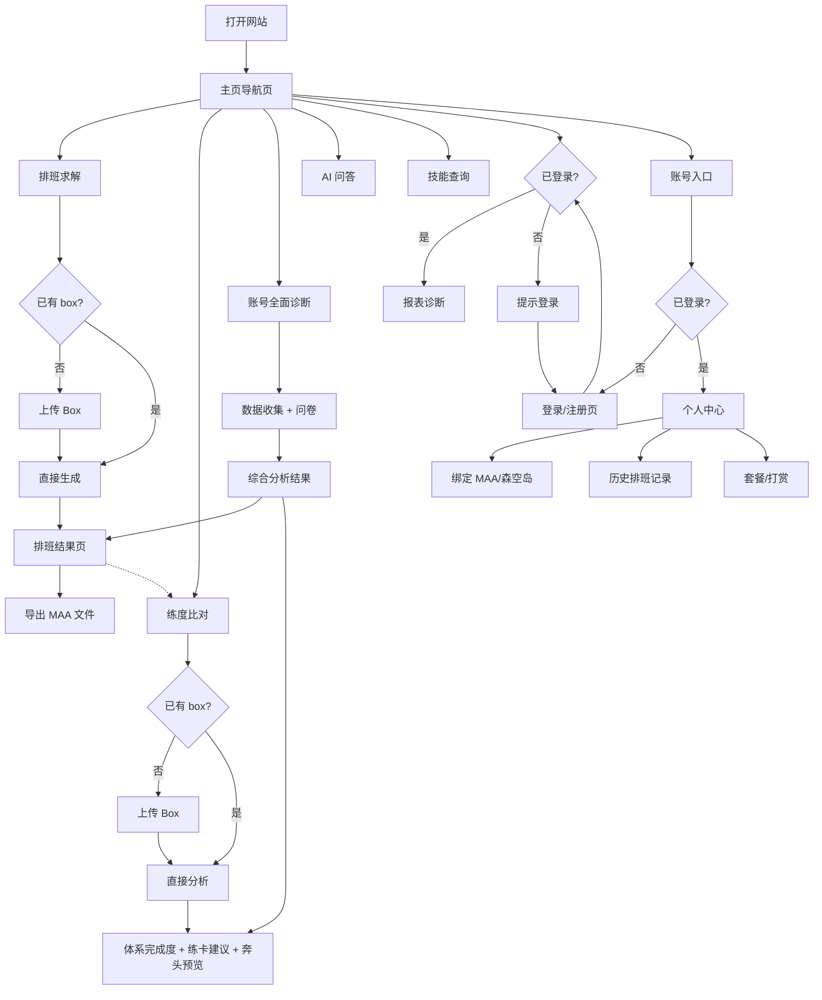

# 罗德岛基建管家 — 网站页面结构设计

> 版本：v0.2  
> 日期：2026-07-10  
> 来源：两次产品对齐会议（文字转写_ray的快速会议_745504727）  
> 用途：交给前端负责人 / Figma AI 生成线框图的参考文档

---

## 一、整体布局概念

**左侧固定导航栏 + 右侧主内容区**，参考 DeepSeek 网页端风格。

```
┌──────────────────────────────────────────┐
│  左侧导航栏（固定，各页面均可见）            │
│  ┌────┐  ┌──────────────────────────┐   │
│  │    │  │      主内容区              │   │
│  │ 导 │  │                          │   │
│  │ 航 │  │  （默认：主页导航）         │   │
│  │ 栏 │  │                          │   │
│  └────┘  └──────────────────────────┘   │
└──────────────────────────────────────────┘
```

左侧导航栏入口（从上到下）：

1. 🏠 主页
2. 🗓 排班求解
3. 📊 练度比对
4. 🤖 AI 问答
5. 📋 技能查询
6. 📈 报表诊断（需登录）
7. 👤 账号（登录/个人中心）

---

## 二、登录策略

| 功能 | 未登录 | 已登录 |
|------|--------|--------|
| 排班求解 | ✅ 完整可用 | ✅ 完整可用 + 保存历史 |
| 练度比对 | ✅ 完整可用（规则层） | ✅ + AI 文字解释 |
| AI 问答 | ✅ 每日 IP 限次 | ✅ 按套餐更多次数 |
| 技能查询 | ✅ 完整可用 | ✅ 完整可用 |
| 报表诊断 | ❌ 提示登录 | ✅ 可用 |
| 排班历史 | ❌ 不保存 | ✅ 自动保存 |
| 森空岛绑定 | ❌ | ✅ 在个人中心绑定 |
| AI 解释层 | ❌ 不生成（零 token 开销） | ✅ 消耗 token |

付费/引流原则：不在页面各处反复推 VIP，避免「吃相难看」。付费功能（更多 AI 对话次数、多账号绑定）自然放在个人中心，不主动弹窗引导。

---

## 三、页面清单与内容描述

### P0 主 Shell（应用框架）

所有页面共享的外层结构。

**左侧导航栏包含：**
- 产品 Logo / 名称
- 导航菜单
- 底部：账号入口（未登录：「登录/注册」；已登录：头像+名称）
- 底部：设置入口

---

### P1 主页 / 导航页（默认首页）

**设计原则：** 干净、简洁，几个醒目入口，参考 DeepSeek 网页端 / PRTS 风格。不在这里展示账号信息。

**页面结构（向下滚动式，类公司官网）：**

#### 第一屏（首屏）

未登录状态：
- 产品 Slogan（例：「把基建交给管家，你来当甩手掌柜」）
- 三个醒目入口按钮：

```
┌─────────────────┐  ┌──────────────────┐  ┌───────────────────┐
│  🗓 生成排班表    │  │  🔍 账号全面诊断   │  │  📊 练度 Box 比对  │
│  我知道要什么    │  │  我不知道要什么    │  │  看我的号练得咋样  │
└─────────────────┘  └──────────────────┘  └───────────────────┘
```

已登录状态（返回用户）：
- 可默认跳转到个人中心，或在首屏顶部显示「欢迎回来，[用户名]」+快捷操作

#### 第二屏及以下（向下滚动）

- 功能介绍：排班求解、练度比对、AI 问答说明
- 使用场景举例
- 开发者信息 / 赞助入口

---

### P2 排班求解页

**功能：** 基于 box 生成最优基建排班方案

**入口二选一（进入时先选路径，或已有 box 直接跳过）：**

- 路径 A「我知道要什么」：直接上传 box → 跑解 → 出排班表
- 路径 B「账号全面诊断」：→ 跳转至 P3 账号诊断页（另开流程）

**已登录且有保存 box：** 跳过上传步骤，直接使用已保存的 box。

#### Step 1：上传 Box（路径A）

- 上传方式：
  - 📁 上传 MAA 练度文件（JSON/CSV）
  - 🌐 森空岛 API（已绑定账号可自动同步）
- 拖拽或点击上传区域
- 说明文字：支持格式、如何从 MAA 导出

#### Step 2：排班结果

- 顶部汇总：方案基本信息、预计产出数值
- 排班方案展示（贴近游戏内基建实际布局，不用纯表格）：
  - 按设施分组：制造站、贸易站、发电站、中枢、宿舍、办公室
  - 每个设施：设施名 + 干员卡片（头像+精英化）+ 效率说明
- 操作区：
  - 「导出 MAA 作业文件」→ 下载 JSON 文件，用户手动放入 MAA
  - 「导出一图流图片」
  - （远期）「导出 mower 方案」
- 底部引导：「想知道练哪些干员能进一步提升？→ 查看练度比对」

**未登录：** 结果页显示规则层数据，无 AI 文字解释  
**已登录：** 额外生成 AI 简短总结（消耗 token）

---

### P3 练度比对页（独立功能页，与排班求解并列）

**功能：** 分析 box，判断体系完成度，给出练卡建议和「奔头」预览

**设计背景：** 有相当一批用户不需要排班表，只是想知道「我的号哪里差、该练谁」。典型场景：「我有红云有酒神，但没练克里斯汀，这组我能用吗？该怎么补？」

**页面结构：**

#### Section 1：Box 输入

- 同排班求解入口：上传文件 / 森空岛 API / 使用已保存 box

#### Section 2：体系完成度总览

- 按设施类型分组，列出所有已建模体系：

| 体系 | 状态 | 核心干员 |
|------|------|---------|
| 巫恋裁缝核 | ⚠️ 练成可用（巫恋未达标） | 巫恋 龙舌兰 卡夫卡 |
| 但书叙拉古链 | ✅ 已成型 | 但书 伺夜 贝洛内 |
| 迷迭香感知链 | ❌ 缺关键搭档 | 缺：迷迭香 |

- 状态标签：✅ 已成型 / ⚠️ 练成可用（有人未达标）/ 🔸 缺关键搭档 / ❌ 缺人

#### Section 3：练卡建议清单

- 按优先级分组（P0 / P1 / P2）
- 每条：干员名 + 目标练度 + 原因说明 + 所属体系
- 「暂缓」类（缺搭档）折叠显示

#### Section 4：「奔头」预览

- 「如果你练了这几个干员，你的体系会变成这样：」
- 展示练前 vs 练后的体系对比（图形化，不生成 MAA 文件）
- 目的：给用户一个回访的动机，练完来重新跑一遍

**已登录额外功能：**
- AI 文字说明（消耗 token）：为什么推荐练这些、体系逻辑简述

---

### P4 账号全面诊断页

**功能：** 不知道自己需求的用户，通过问卷 + 数据输入，得到个性化排班推荐

**页面结构：**

#### Step 1：数据收集

- 连接森空岛 API（已绑定可自动读取：理智、无人机、仓库钱书——具体读取字段待验证）
- 或手动填写：当前钱/书库存、三日产出报表

#### Step 2：需求问卷（简短）

- 目标：搓玉 / 平衡 / 极大化钱 / 极大化经验
- 投入意愿：不愿意练人 / 愿意练高性价比 / 愿意为效率练任何人
- 上线习惯：每天手动换班 / 自动轮换摆烂

#### Step 3：综合分析结果

- 账号画像（规则层，零 AI 开销）：现有体系、缺失体系、钱书比是否健康
- 排班推荐：基于当前 box 的最优方案
- 练卡建议：同练度比对页，按优先级列出
- 已登录：AI 文字总结（消耗 token）

---

### P5 AI 问答页

**功能：** 与基建知识 Agent 对话

**页面元素：**
- 对话区（主体，类 ChatGPT 界面）
- 输入框（底部固定）
- 首次打开：展示 3-5 个示例问题
- 未登录：顶部横幅「今日剩余 X 次提问（IP 限制）」
- 已登录 / 套餐用户：显示套餐状态

**右侧可折叠：**
- 已有 box 数据时：显示当前 box 摘要，Agent 可引用

---

### P6 技能查询页

**功能：** 查询基建技能列表，筛选组合

**页面元素：**
- 筛选栏：按设施、稀有度、效果类型
- 搜索框
- 干员卡片列表，点击展开详情（技能说明 + 适用组合 + 搭配干员）
- 底部 Tab：「干员技能」/ 「常见组合」

（也可考虑直接外链 arkntools，省前端工作量）

---

### P7 报表诊断页（需登录）

**功能：** 上传三日报表，诊断基建健康状态

**页面结构：**

#### 输入区
- 上传报表截图 / 手动填写三日平均数值
- 输入当前库存（钱/书）

#### 诊断结果
- 健康度评分（可视化仪表盘）
- 问题项高亮（钱书比失衡 / 某设施产出偏低）
- 库存缺口计算
- 建议操作

---

### P8 登录 / 注册页

- 注册：用户名 + 邮箱 + 密码
- 登录：邮箱 + 密码

---

### P9 个人中心页

- 账号基本信息
- **绑定管理：** MAA 练度文件上传 / 森空岛 API Token
- **历史记录：** 历史排班方案列表，可重新加载
- **套餐状态：** AI 问答剩余次数 / 打赏/月卡入口
- **开发者信息 / 赞助**

---

## 四、页面跳转关系（Mermaid）



---

## 五、给 Figma AI 的提示词

> 把下面这段直接粘给 Figma AI 或 FigJam AI，让它生成线框图 / 流程图。

```
请为一个明日方舟基建工具网站生成线框图。网站名：罗德岛基建管家。

整体布局：左侧固定导航栏 + 右侧主内容区（参考 DeepSeek 网页端风格）。

左侧导航栏入口：主页、排班求解、练度比对、AI 问答、技能查询、报表诊断、账号。

共 9 个主要页面：

1. 主页（导航页）
   干净简洁，参考公司官网样式。首屏：产品 Slogan + 三个醒目入口按钮（生成排班表、账号全面诊断、练度Box比对）。向下滚动：功能介绍区块、开发者信息。不在首页展示账号信息。

2. 排班求解页
   三步：上传 Box 文件（MAA/森空岛）→ 等待求解 → 排班结果（游戏内基建真实布局风格，按设施展示干员组合）。结果页底部有「导出MAA文件」按钮和「查看练度比对」引导。

3. 练度比对页（独立功能页）
   输入 Box → 显示体系完成度列表（已成型/可练后可用/缺搭档/缺人）→ 练卡建议清单（按P0/P1/P2优先级）→ 练前练后对比预览（激励用户回访）。

4. 账号全面诊断页
   分三步：收集数据（森空岛API或手动填写钱书）→ 简短需求问卷（目标/意愿/习惯）→ 综合分析结果（账号画像+排班推荐+练卡建议）。

5. AI 问答页
   类 ChatGPT 对话界面，底部输入框，顶部显示剩余次数（未登录时）。右侧可折叠 Box 摘要。

6. 技能查询页
   左侧筛选栏（设施/稀有度/效果），右侧干员卡片网格，点击展开详情。

7. 报表诊断页（需登录）
   上传三日报表 / 手动填写，生成健康度诊断结果和建议。

8. 登录/注册页
   简洁表单，登录和注册两个 Tab。

9. 个人中心页
   分区：绑定管理（MAA/森空岛）、历史排班记录、套餐/打赏状态。

设计风格：简洁现代，明日方舟游戏工具类网站风格。
```

---

## 六、已确认事项

- [x] 练度比对是独立页面，不是排班结果的附属区
- [x] 主页为干净导航页，账号信息在独立的个人中心页
- [x] 求解器不需要登录即可使用
- [x] AI 解释层仅对已登录用户开放（控制 token 开销）
- [x] 付费/引流不过度暴露，不影响主要功能体验
- [x] MAA 导出暂为下载文件，稳定上线后再与 MAA 团队对接深度集成
- [x] 不做 APP，响应式网站即可

## 七、待确认事项

- [ ] 三个主入口按钮的最终文案措辞
- [ ] 已登录用户返回时，是跳转到个人中心还是停在主页（记住上次状态？）
- [ ] 森空岛 API 具体能读取哪些字段（理智/无人机/钱书/仓库）——影响诊断页的自动化程度
- [ ] 技能查询是自己做还是外链 arkntools
- [ ] 排班结果页和练度比对页是否共享同一份 box 数据（同一会话内不重复上传）
- [ ] 移动端：导航栏改成底部 Tab Bar？
